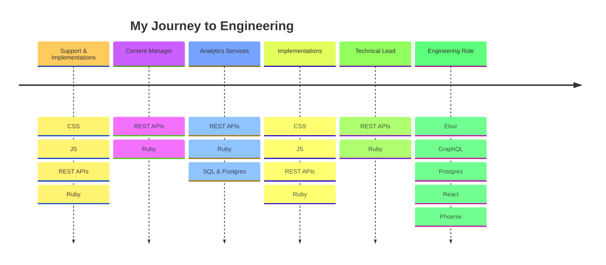
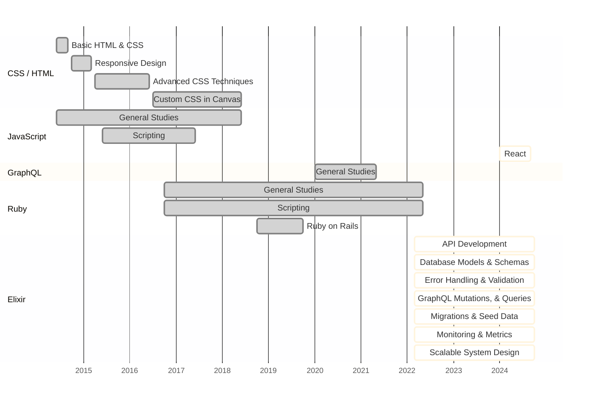

## 

### I love learning through creation and practice

### Tools & Helpers I Use

|                                                                 Tool                                                                  | Communication | Productivity | Development |
| :-----------------------------------------------------------------------------------------------------------------------------------: | :-----------: | :----------: | :---------: |
|                |               |      ✅      |     ✅      |
|                           |               |      ✅      |     ✅      |
|                           |               |      ✅      |             |
|                        |               |      ✅      |             |
|                              |      ✅       |      ✅      |             |
|                                 |      ✅       |      ✅      |             |
|                              |      ✅       |      ✅      |             |
|            |      ✅       |      ✅      |             |
|        |      ✅       |      ✅      |             |
|  |      ✅       |      ✅      |             |

### Learning & Skill Track

