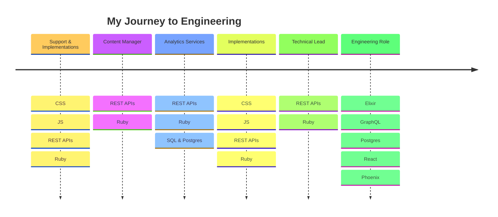

# 

## I love learning through creation and practice

```mermaid
%%{
  init: {
    'logLevel': 'debug',
    'theme': 'base'
  }
}%%
timeline
    title My Journey to Engineering
    Support & Implementations
      : CSS
      : JS
      : REST APIs
      : Ruby
    Content Manager
      : REST APIs
      : Ruby
    Analytics Services
      : REST APIs
      : Ruby
      : SQL & Postgres
    Implementations
      : CSS
      : JS
      : REST APIs
      : Ruby
    Technical Lead
      : REST APIs
      : Ruby
    Engineering Role
      : Elixir
      : GraphQL
      : Postgres
      : React
      : Phoenix
```

## Time Spent Actively Coding (since 2018)

